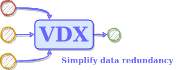

# VDX
 

VDX is a generic vote definition specification. It aims to be a simple way to define the behavior of voting software.

## Features

- Simple specification for software defined voting
- Fully customizable voting algorithms
- Support for stateless and stateful (history-aware) voting
- Tunable voting parameters
- Optional bootstrapping algorithm to speed up convergence of history-based voting

The contents of this repository are as follows:

- The specification as a JSON schema, outlining the possible configurations for voting algorithms.
- A simple implementation of the specification, in the form of a Python module.
- A folder of samples for different use-cases.
- A demo app as a Docker image with lightweight pre-configured VDX compliant algorithms for evaluation. Uses an old version of the CSV voter sample and does not support custom algorithm definitions but replicates well-known algorithms and can be used to merge simple datasets or to compare the performance of different algorithms.
- A folder with experimental features under development, such as new voting algorithms being investigated for inclusion.

## VDX Fields

The VDX speification has the following fields:

- **algorithm_name**: The name of the algorithm.
- **quorum**: The type of quorum for te vote expressed as 'UNTIL' or 'ALL_BUT'. Until means that the quorum percentage is the minimum percentage of votes required to vote. All but means that the quorum percentage is the maximum percentage of votes required to vote.
- **quorum_percentage**: The percentage of the total number of voters
- **exclusion**: The type of exclusion for the vote expressed as 'NONE', 'FURTHEST', 'OUTSIDE_SIGMA'. NONE means that no exclusion is used. FURTHEST means that the voter is excluded if is is the furthest voter from the median. OUTSIDE_SIGMA means that the vote is excluded if the voter is outside the sigma range of the median.
- **exclusion_threshold**: The number of furthest votes from the median that are excluded, or the number of sigmas away from the median a voter needs to be to be excluded.
- **bootstrapping**: Whether or not bootstrapping is used.
- **history**: The algorithm used to compute the history. More details can be found in the next section.
- **params**: The parameters for the history algorithm. Each algorithm has different parameters.
- **collation**: The algorithm used to collate the votes. Currently 'MEAN' and 'MEAN_NEAREST_NEIGHBOR' are supported.

## History Algorithms

- **NONE**: No history is used.
- **STANDARD**: The standard history based weighted average. The vote result is the weighted average of the votes. Weights are derived based on the squared ratio of previous successes over all voting rounds.
    - **Parameters**: 
        - '**error**': The error margin for an agreement between modules. 
- **MODULE_ELIMINATION**: The module elimination history algorithm. The vote result is the weighted average of the votes. Weights are derived based on the squared ratio of previous successes over all voting rounds. The vote is eliminated if the module's history is below the average of all module histories.
    - **Parameters**: 
        - '**error**': The error margin for an agreement between modules. 
- **HYBRID**: A hybrid of Module Elimination and Soft Dynamic Thresohold voting. Weights are defined based on the sum of agreement scores of a module over the number of modules. Histories are defined granularly, with partial agreements being possible.
    - **Parameters**: 
        - '**error**': The error margin for a full agreement between modules. 
        - '**scaling**': The multiple of 'error' beyond which there is no longer even partial agreement.
- **Bootstrapping**: When bootstrapping is enabled, the vote will use approximate majority voting via clustering instead of weighted average, when the weights are all 0 (ie after a failure) or all 1 (immediately after initialization). 

## Sample implementation

The sample implementation is a simple Python module that implements the VDX specification. It consists of a stateless module that implements the individual components that can be used to assemble a VDX algorithm. It also contains a 'service' module that implements a stateful facade (with Redis as the storage solution) that can be used by client code to implement a VDX-based voting system. The service module alone is enough to be used for single value voting (eg for submitting the values of sensors to get back a merged result). Adapters can be created to vote on more complex use-cases. 2 such adapters are provided in the sample folder.

## Samples

- **CSV voter**: A simple voter that reads a CSV file and votes on the values. Each column represents a candidate and each row represents a voting round. The result is a CSV file with one column and the same number of rows as the input file.

- **CSV merger**: A simple voter that merges CSV files on an index column. It votes on each value of each row of all files, collecting them by the index column. Thus, each file represents a candidate and each cell represents a voting round. The result is a CSV file with the same number of columns as the inpurts, and rows for all unique values of the index column.

- **DiMOS worker/voter**: A sample end to end application that uses VDX. It consists of a worker script that executes a data collection job (implemented using a Docker container) and pushes it to an intermediate git repository. A voter script can then merge different branches of the git repository by voting on the results to create a ground truth branch. The voter script makes use of the CSV merger voter but supports multiple files for each repository.

## Demo

The demo application contains 6 sample algorithms but no persistence or the ability to define algorithms with VDX. It does however, allow easy merging of CSV files (using the same method as the CSV voter) and the comparison of state-of-the-art algorithms.

## Zenodo Archived version:

